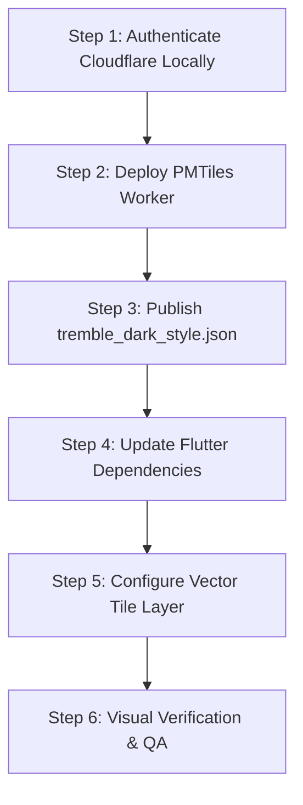

# Plan: Protomaps Apple Maps Style & Production Deployment

**Plan ID:** 20260519-map-styling-production  
**Risk Level:** MEDIUM  
**Founder Approval Required:** YES  
**Branch:** `feature/map-styling-production`  

---

## 1. Objective
Achieve a premium, dark-mode "Apple Maps" aesthetic (Deep Graphite land `#1A1A18`, Slate-Blue water `#131924`, Deep Olive parks `#17221A`, high-contrast road lines, and legible typography) inside the Tremble Map Sandbox, publish the style sheet, and sync the mobile Flutter client to load the styled map.

---

## 2. Infrastructure Setup & Publication Strategy

### Where does `tremble_dark_style.json` go?
To make the map engine work, the style JSON must be accessible to the mapping client at runtime.
1. **Web Sandbox:** Already placed in `Website/Izvedba/tremble-website/public/tremble_dark_style.json`. Next.js serves this statically at `https://trembledating.com/tremble_dark_style.json`.
2. **Mobile Client (Flutter):**
   * **Option A (Statically Bundled):** We place it inside the Flutter assets folder (`assets/map/tremble_dark_style.json`) and parse it locally on the device. (Recommended: Zero network latency, instant load).
   * **Option B (Dynamically Fetched):** We host it on Cloudflare (e.g. `https://maps.trembledating.com/style.json`) and the app fetches it at boot.

---

## 3. Technology Evaluation: Vector vs. Raster for Mobile

To future-proof Tremble and keep native performance butter-smooth, we evaluate two paths:

### Path 1: Vector Tiles (Recommended for Performance & Scale)
* **How it works:** The Cloudflare Worker only serves raw vector tiles (MVT format) from the `planet.pmtiles` file in the R2 bucket. The mobile client (Flutter) downloads the vector data and renders the map locally using the device's GPU, styling it using our `tremble_dark_style.json`.
* **Pros:**
  * **Zero Server Rendering Costs:** Cloudflare Workers only serve static bytes. Running costs are negligible (~$1.50/mo for R2 storage).
  * **Infinite Sharpness:** Road lines and text labels remain perfectly crisp at any zoom level, with smooth interpolation.
  * **Dynamic Labels:** Text dynamically rotates with the map so it is always readable.
* **Cons:** Requires adding vector map rendering packages in `pubspec.yaml` (such as `vector_map_tiles`).

### Path 2: Raster Tiles (Legacy fallback)
* **How it works:** The Cloudflare Worker reads the vector data, renders it into PNG images on the fly using a style sheet, and serves the finished PNG to Flutter.
* **Pros:** Standard `flutter_map` setup without extra dependencies.
* **Cons:** Extremely high CPU/memory usage on the Cloudflare Worker, high latency, poor scaling, and text/lines become pixelated when zooming.

**Co-Founder Recommendation:** Go with **Path 1 (Vector Tiles)**. It matches the premium, high-performance aesthetic required by Tremble.

---

## 4. Step-by-Step Execution Plan



### Step 1: Authenticate Cloudflare Locally
Because the AI agent is sandboxed inside the workspace and does not have access to your browser session or password manager, **you (the founder) must run the login command**:
1. Open your terminal.
2. Run:
   ```bash
   npx wrangler login
   ```
3. Your web browser will open. Log in to the Cloudflare account associated with `trembledating.com`.

### Step 2: Deploy the Protomaps PMTiles Worker
1. Configure your R2 bucket `tremble-maps-planet` (or where `planet.pmtiles` is uploaded).
2. Deploy the official PMTiles worker script to serve vector tiles under `maps.trembledating.com`.

### Step 3: Publish `tremble_dark_style.json`
* Upload `tremble_dark_style.json` to the root of the worker or make sure it is reachable at:
  `https://maps.trembledating.com/tremble_dark_style.json`
* Set the `sources` URL in the style JSON to point to the TileJSON endpoint:
  ```json
  "sources": {
    "protomaps": {
      "type": "vector",
      "url": "https://maps.trembledating.com/planet.json"
    }
  }
  ```

### Step 4: Update Flutter Dependencies
Add support for vector tiles to your `pubspec.yaml`:
```yaml
dependencies:
  flutter_map: ^7.0.0
  vector_map_tiles: ^8.0.0
  vector_map_tiles_pmtiles: ^3.0.0
```

### Step 5: Configure the Flutter Vector Layer
Update `tremble_map_screen.dart` to use vector rendering styled by `tremble_dark_style.json`:
```dart
VectorTileLayer(
  theme: _loadTrembleDarkTheme(), // Loads tremble_dark_style.json
  tileProviders: TileProviders({
    'protomaps': PMTilesTileProvider(
      url: 'https://maps.trembledating.com/planet.pmtiles',
    ),
  }),
)
```

---

## 5. Verification Checklist
- [ ] TypeScript `tsc --noEmit` returns clean.
- [ ] Wrangler is logged in successfully on dev machine.
- [ ] `maps.trembledating.com/planet.pmtiles` returns HTTP 206 for Range requests.
- [ ] `tremble_dark_style.json` is validated and served with CORS headers.
- [ ] Flutter app loads vector tiles and renders custom styling successfully.
