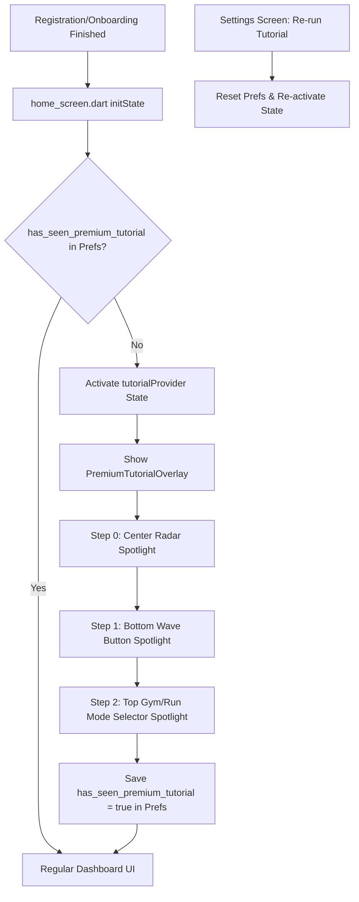

# Premium Tutorial Flow — Detailed Implementation Plan

This document outlines the step-by-step implementation of a brand-compliant, high-end 3-step tutorial overlay for the Tremble app dashboard. It uses a **Custom SpotlightPainter** for smooth focal cutouts, **Riverpod** for robust state management, and **SharedPreferences** for persistence.

---

## 1. Architecture Overview



---

## 2. Step 1: Create State Management Provider
Create a new file at `lib/src/features/dashboard/application/tutorial_notifier.dart` to handle state transitions and local storage persistence.

```dart
import 'package:flutter_riverpod/flutter_riverpod.dart';
import 'package:shared_preferences/shared_preferences.dart';

class TutorialState {
  final bool isActive;
  final int currentStep;
  TutorialState({required this.isActive, required this.currentStep});

  TutorialState copyWith({bool? isActive, int? currentStep}) {
    return TutorialState(
      isActive: isActive ?? this.isActive,
      currentStep: currentStep ?? this.currentStep,
    );
  }
}

class TutorialNotifier extends Notifier<TutorialState> {
  static const _prefsKey = 'has_seen_premium_tutorial';

  @override
  TutorialState build() => TutorialState(isActive: false, currentStep: 0);

  Future<void> checkFirstLaunch() async {
    final prefs = await SharedPreferences.getInstance();
    final hasSeen = prefs.getBool(_prefsKey) ?? false;
    if (!hasSeen) {
      state = TutorialState(isActive: true, currentStep: 0);
    }
  }

  void nextStep() {
    if (state.currentStep < 2) {
      state = state.copyWith(currentStep: state.currentStep + 1);
    } else {
      completeTutorial();
    }
  }

  void prevStep() {
    if (state.currentStep > 0) {
      state = state.copyWith(currentStep: state.currentStep - 1);
    }
  }

  Future<void> completeTutorial() async {
    state = TutorialState(isActive: false, currentStep: 0);
    final prefs = await SharedPreferences.getInstance();
    await prefs.setBool(_prefsKey, true);
  }

  Future<void> resetTutorial() async {
    final prefs = await SharedPreferences.getInstance();
    await prefs.setBool(_prefsKey, false);
    state = TutorialState(isActive: true, currentStep: 0);
  }
}

final tutorialProvider = NotifierProvider<TutorialNotifier, TutorialState>(() {
  return TutorialNotifier();
});
```

---

## 3. Step 2: Implement the Glowing Spotlight CustomPainter
Create a file `lib/src/features/dashboard/presentation/widgets/spotlight_painter.dart`.
This painter draws a semi-transparent dark graphite canvas and cuts out a clear circle at the targeted element coordinates, with a beautiful glowing Rose Pink (`#F4436C`) border.

```dart
import 'package:flutter/material.dart';

class SpotlightPainter extends CustomPainter {
  final Offset center;
  final double radius;
  final Color overlayColor;

  SpotlightPainter({
    required this.center,
    required this.radius,
    this.overlayColor = const Color(0xCC1A1A18), // 80% opacity Deep Graphite
  });

  @override
  void paint(Canvas canvas, Size size) {
    final paint = Paint()
      ..color = overlayColor
      ..style = PaintingStyle.fill;

    final rect = Rect.fromLTWH(0, 0, size.width, size.height);
    final overlayPath = Path()..addRect(rect);
    final spotlightPath = Path()
      ..addOval(Rect.fromCircle(center: center, radius: radius));

    // Subtract circular spotlight from solid background
    final finalPath = Path.combine(PathOperation.difference, overlayPath, spotlightPath);
    canvas.drawPath(finalPath, paint);

    // Subtle premium Rose Pink outer glow around the spotlight
    final borderPaint = Paint()
      ..color = const Color(0xFFF4436C).withOpacity(0.6)
      ..style = PaintingStyle.stroke
      ..strokeWidth = 2.5
      ..maskFilter = const MaskFilter.blur(BlurStyle.outer, 8.0);

    canvas.drawCircle(center, radius, borderPaint);
  }

  @override
  bool shouldRepaint(covariant SpotlightPainter oldDelegate) {
    return oldDelegate.center != center || oldDelegate.radius != radius;
  }
}
```

---

## 4. Step 3: Design the Glassmorphic Overlay Widget
Create a file at `lib/src/features/dashboard/presentation/widgets/premium_tutorial_overlay.dart`.
This widget reads the current step from `tutorialProvider`, calculates spotlight offsets, and displays the descriptive `GlassCard`.

```dart
import 'dart:ui';
import 'package:flutter/material.dart';
import 'package:flutter_riverpod/flutter_riverpod.dart';
import 'package:google_fonts/google_fonts.dart';
import '../../../../shared/ui/glass_card.dart';
import '../application/tutorial_notifier.dart';
import 'spotlight_painter.dart';

class PremiumTutorialOverlay extends ConsumerWidget {
  const PremiumTutorialOverlay({Key? key}) : super(key: key);

  @override
  Widget build(BuildContext context, WidgetRef ref) {
    final state = ref.watch(tutorialProvider);
    if (!state.isActive) return const SizedBox.shrink();

    final mediaQuery = MediaQuery.of(context);
    final screenWidth = mediaQuery.size.width;
    final screenHeight = mediaQuery.size.height;

    // Define coordinates & sizes for the 3 steps
    Offset spotlightCenter = Offset.zero;
    double spotlightRadius = 0.0;
    String title = '';
    String description = '';
    bool showCardAtTop = false;

    switch (state.currentStep) {
      case 0: // Sredinski radar
        spotlightCenter = Offset(screenWidth / 2, screenHeight * 0.44);
        spotlightRadius = 135.0;
        title = 'Skeniranje bližine';
        description = 'Tremble ves čas diskretno skenira tvojo okolico. Ko zazna drugega člana v tvojem radiju, te na to opozori s kratkim vibracijskim signalom.';
        showCardAtTop = false; // Show text below the center spotlight
        break;
      case 1: // Wave gumb na dnu
        spotlightCenter = Offset(screenWidth / 2, screenHeight - 65 - mediaQuery.padding.bottom);
        spotlightRadius = 45.0;
        title = 'Brez praznega klepeta';
        description = 'Pridrži gumb 👋, da pošlješ signal. Brez odvečnega dopisovanja — komunikacija se odpre šele takrat, ko sta oba pripravljena na srečanje v živo.';
        showCardAtTop = true; // Show text at the top to avoid overlapping
        break;
      case 2: // Gym/Run stikalo na vrhu
        spotlightCenter = Offset(screenWidth / 2, 70 + mediaQuery.padding.top);
        spotlightRadius = 75.0;
        title = 'Skupne točke';
        description = 'Preklopi na Gym Mode ali Run Club, ko treniraš. Spoznaj ljudi, ki obiskujejo isti fitnes ali tečejo na enakih progah.';
        showCardAtTop = false; // Show text below the top spotlight
        break;
    }

    return Stack(
      children: [
        // Glassmorphism Blur background
        Positioned.fill(
          child: BackdropFilter(
            filter: ImageFilter.blur(sigmaX: 5.0, sigmaY: 5.0),
            child: CustomPaint(
              painter: SpotlightPainter(
                center: spotlightCenter,
                radius: spotlightRadius,
              ),
            ),
          ),
        ),

        // Text Card and Controls
        AnimatedPositioned(
          duration: const Duration(milliseconds: 300),
          curve: Curves.easeInOut,
          left: 20,
          right: 20,
          top: showCardAtTop ? 100 + mediaQuery.padding.top : null,
          bottom: !showCardAtTop ? 120 + mediaQuery.padding.bottom : null,
          child: Material(
            color: Colors.transparent,
            child: GlassCard(
              padding: const EdgeInsets.all(20),
              child: Column(
                mainAxisSize: MainAxisSize.min,
                crossAxisAlignment: CrossAxisAlignment.stretch,
                children: [
                  // Elegant Playfair Title
                  Text(
                    title,
                    style: GoogleFonts.playfairDisplay(
                      fontSize: 22,
                      fontWeight: FontWeight.bold,
                      color: Colors.white,
                    ),
                  ),
                  const SizedBox(height: 10),
                  // Instrument Sans body text
                  Text(
                    description,
                    style: GoogleFonts.instrumentSans(
                      fontSize: 14,
                      color: Colors.white.withOpacity(0.85),
                      height: 1.4,
                    ),
                  ),
                  const SizedBox(height: 20),
                  Row(
                    mainAxisAlignment: MainAxisAlignment.spaceBetween,
                    children: [
                      // Elegant minimalist dots
                      Row(
                        children: List.generate(3, (index) {
                          final isCurrent = index == state.currentStep;
                          return AnimatedContainer(
                            duration: const Duration(milliseconds: 200),
                            margin: const EdgeInsets.symmetric(horizontal: 3),
                            height: 4,
                            width: isCurrent ? 16 : 8,
                            decoration: BoxDecoration(
                              color: isCurrent ? const Color(0xFFF4436C) : Colors.white.withOpacity(0.3),
                              borderRadius: BorderRadius.circular(2),
                            ),
                          );
                        }),
                      ),
                      // Navigation Buttons
                      Row(
                        children: [
                          TextButton(
                            onPressed: () => ref.read(tutorialProvider.notifier).completeTutorial(),
                            child: Text(
                              'Preskoči',
                              style: GoogleFonts.instrumentSans(
                                color: Colors.white.withOpacity(0.5),
                                fontSize: 13,
                              ),
                            ),
                          ),
                          const SizedBox(width: 8),
                          ElevatedButton(
                            style: ElevatedButton.styleFrom(
                              backgroundColor: const Color(0xFFF4436C),
                              shape: RoundedRectangleBorder(
                                borderRadius: BorderRadius.circular(20),
                              ),
                              padding: const EdgeInsets.symmetric(horizontal: 20, vertical: 8),
                            ),
                            onPressed: () => ref.read(tutorialProvider.notifier).nextStep(),
                            child: Text(
                              state.currentStep == 2 ? 'Končaj' : 'Naprej',
                              style: GoogleFonts.instrumentSans(
                                color: Colors.white,
                                fontWeight: FontWeight.bold,
                                fontSize: 13,
                              ),
                            ),
                          ),
                        ],
                      ),
                    ],
                  ),
                ],
              ),
            ),
          ),
        ),
      ],
    );
  }
}
```

---

## 5. Step 4: Integrate in `home_screen.dart`
Now, wire the premium tutorial flow directly into your central screen.

1. Open `lib/src/features/dashboard/presentation/home_screen.dart`.
2. Delete the legacy `WaveSimulationOverlay` reference and state variables (e.g. `_showTutorial` and imports).
3. Import the new files:
   ```dart
   import 'application/tutorial_notifier.dart';
   import 'widgets/premium_tutorial_overlay.dart';
   ```
4. In `initState()`, trigger the first launch check:
   ```dart
   WidgetsBinding.instance.addPostFrameCallback((_) {
     // Replaces old legacy checks
     ref.read(tutorialProvider.notifier).checkFirstLaunch();
   });
   ```
5. In the widget `build(BuildContext context)` method, add the overlay at the very bottom of the main root `Stack` so it sits on top of everything else:
   ```dart
   return Stack(
     children: [
       // ... existing dashboard widgets ...
       
       // Premium Tutorial Layer
       const PremiumTutorialOverlay(),
     ],
   );
   ```

---

## 6. Step 5: Wire Re-run Option in Settings
To allow the founder or users to re-run the tutorial at any time:

1. Open `lib/src/features/settings/presentation/settings_screen.dart`.
2. Under the dynamic options (e.g., inside `_buildMyGymsContent` or right next to Lifestyle/Preferences), add a new tile:
   ```dart
   ListTile(
     leading: const Icon(LucideIcons.helpCircle, color: Color(0xFFF4436C)),
     title: Text(
       'Spoznaj Tremble ponovno',
       style: GoogleFonts.instrumentSans(color: Colors.white),
     ),
     subtitle: Text(
       'Ponovni ogled kratkega interaktivnega vodiča',
       style: GoogleFonts.instrumentSans(color: Colors.white.withOpacity(0.5), fontSize: 12),
     ),
     trailing: const Icon(LucideIcons.chevronRight, color: Colors.white38),
     onTap: () async {
       // Reset status and redirect back to Dashboard
       await ref.read(tutorialProvider.notifier).resetTutorial();
       if (mounted) {
         context.go('/'); // Navigate back to central radar screen
       }
     },
   )
   ```

---

## 7. Verification Protocol

Run the following checks inside the terminal to ensure clean styling, formatting, and zero warnings:

```bash
dart format .
flutter analyze
```
Confirm on a physical simulator or iPhone:
1. First startup shows a beautiful zameglitev and spotlight on the Radar.
2. Clicking "Naprej" moves focus with a smooth fade-in to the Wave button.
3. Clicking "Naprej" moves focus to the Gym/Run club tabs.
4. Clicking "Končaj" or "Preskoči" closes it, and subsequent app restarts skip it completely.
5. Clicking the row in Settings successfully triggers the tutorial again.
