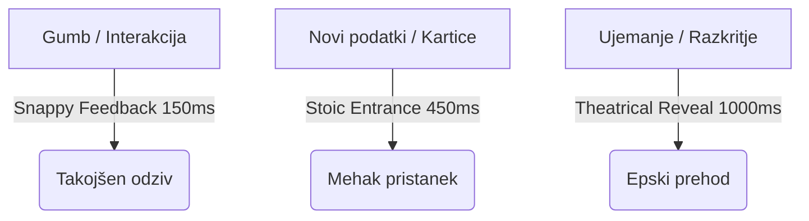

# ADR-007: Motion Vocabulary & Emotional Arc Map

> **Status:** APPROVED  
> **Author:** Antigravity (Technical Co-Founder)  
> **Date:** 2026-05-18  
> **Context:** Design Direction & Warmth Audit (May 2026)  

---

## 1. MOTION VOCABULARY (Gibalni zaklad Tremble)

V Tremble ne dodajamo dekorativnih animacij. Gibanje je del vmesnika, ki komunicira fizikalnost in čustveno težo. Ker aplikacija temelji na **glassmorphismu (steklu)**, se morajo elementi gibati kot resnični fizikalni objekti: imeti morajo maso, trenje in gladko pojemati (decelerate).

### A. Sistemske krivulje (Standard Easing Curves)

Za zagotovitev konsistentnosti po celotni aplikaciji se uveljavljajo **tri namenske krivulje (Cubic Beziers)**. Vsaka krivulja je izbrana za točno določen čustveni kontekst:

| Ime krivulje | Koda (Cubic Bezier) | Trajanje | Uporaba (Use Case) | Čustveni učinek |
| :--- | :--- | :--- | :--- | :--- |
| **Stoic Entrance** | `Cubic(0.16, 1, 0.3, 1)` | `350ms - 450ms` | Vstop radar kartic, pojav GlassCard | **Varnost & Trdnost.** Hiter začetek, izjemno dolg in mehak zaključek. |
| **Snappy Feedback** | `Cubic(0.2, 0.8, 0.2, 1)` | `150ms - 200ms` | Odziv gumbov na dotik, haptični klik | **Takojšnja odzivnost.** Kratek, odsekan in natančen gib brez nihanja. |
| **Theatrical Reveal** | `Cubic(0.86, 0, 0.07, 1)` | `800ms - 1200ms` | Match Reveal zaslon, odpiranje vala | **Pričakovanje (Suspense).** Počasen začetek, hiter poteg na sredini, ultra-počasen konec. |



---

### B. Implementacija v Flutter-ju

Razvijalci morajo namesto sistemskih krivulj (`Curves.easeOut`, `Curves.linear`) uporabljati ta razred:

```dart
class TrembleMotion {
  /// Stoic Entrance - Hiter začetek, izjemno mehak zaključek.
  /// Uporabiti za vstopne kartice in modalna okna.
  static const Curve stoicEntrance = Cubic(0.16, 1.0, 0.3, 1.0);

  /// Snappy Feedback - Za takojšnje mikro-interakcije.
  /// Uporabiti za hover stanja, klik gumbov.
  static const Curve snappyFeedback = Cubic(0.2, 0.8, 0.2, 1.0);

  /// Theatrical Reveal - Dolg, dramatičen prehod z zadržkom.
  /// Uporabiti izključno za Match Reveal in prehod na celoten profil.
  static const Curve theatricalReveal = Cubic(0.86, 0.0, 0.07, 1.0);

  // Časovni standardi (Durations)
  static const Duration instant = Duration(milliseconds: 150);
  static const Duration feedback = Duration(milliseconds: 200);
  static const Duration entrance = Duration(milliseconds: 400);
  static const Duration theatrical = Duration(milliseconds: 900);
}
```

---

## 2. EMOTIONAL ARC MAP (Karta čustvenih stanj uporabnika)

Tremble ne sme delovati kot neskončni igralni avtomat (kot Tinder). Uporabnikovo potovanje skozi sejo ima jasen vrhunec in vrnitev v resnični svet. Naša naloga je, da se oblikovanje prilagaja tem čustvenim stanjem.

```
       [4. VRHUNEC: Ujemanje] - Dopaminski val (Heartbeat Haptics)
              /            \
    [3. Tišina]             [5. Fokus] - 30-minutno okno (Skoncentrirano delovanje)
       /                      \
[2. Iskanje]                   [6. Zaključek] - Window closed (Spokojno sprejetje)
     /
[1. Vstop] - Prizemljitev (Ambient)
```

### Faza 1: VSTOP (Grounding)
* **Dejanje:** Uporabnik odpre aplikacijo.
* **Čustvo:** Pričakovanje, rahla napetost, upanje.
* **Vizualni odgovor:** Globok grafitni ambient, odsotnost kakršnih koli oglasov, takojšen prehod v umirjeno stanje radarja.
* **Haptika:** Brez (tišina).

### Faza 2: DISCOVERY (The Scan)
* **Dejanje:** Radar se vrti in išče bližnje tekače/uporabnike.
* **Čustvo:** Aktivno iskanje, upanje, radovednost.
* **Vizualni odgovor:** Zelo mehak, organski krožni pulz (15-sekundni intervali vrtenja). Rožnati toni so minimalni, prevladujejo globoke grafitne sence.
* **Haptika:** Brez haptičnega hrupa, da ne utrjujemo občutka "igre".

### Faza 3: TIŠINA (The Empty State)
* **Dejanje:** Radar po nekaj krogih ne najde nikogar.
* **Čustvo:** Razočaranje, občutek zavrnitve, praznina.
* **Vizualni odgovor:** Prehod v mehak `WarmthEmptyState` zaslon. Topla kremna pisava, ki uporabnika pomiri: *"Quiet out there. Live your day — we're watching."*
* **Čustveni učinek:** Uporabnika razbremenimo pritiska. Sporočamo mu, da je vse v redu, naj odloži telefon in gre živet svoje življenje.

### Faza 4: VRHUNEC (The Intercept)
* **Dejanje:** Potrjeno obojestransko ujemanje (Mutual Wave).
* **Čustvo:** **Močan dopaminski val, presenečenje, veselje.**
* **Vizualni odgovor:** 
  1. **400ms tišine (Match Pause):** Medtem ko se v ozadju sproži ujemanje, aplikacija za 400ms ne stori ničesar – radar le tiho pulzira, kartica se še ne odpre. To ustvari vrhunsko napetost.
  2. **Heartbeat Haptics:** Dvojni `mediumImpact` sunek z 80ms zamikom, ki simulira pospešen utrip srca.
  3. **Theatrical Reveal:** Dolga 900ms animacija, ki razkrije profilno fotografijo z nežnim rožnatim sijem in imenom v elegantni pisavi *Playfair Display Italic*.

### Faza 5: FOKUS (The Countdown Window)
* **Dejanje:** 30-minutno okno za interakcijo je aktivno.
* **Čustvo:** Fokus, adrenalin, hitro odločanje.
* **Vizualni odgovor:** Odstranitev vseh drugih motenj. Uporabnik nima klasične klepetalnice. Na voljo sta le dve jasni, arhitekturni akcijski tipki: *"Delite številko"* ali *"Pošljite enkratno fotografijo"*.
* **Čustveni učinek:** Preprečujemo neskončno spletno dopisovanje. Fokus je na hitrem premiku v realni svet.

### Faza 6: ZAKLJUČEK (Peaceful Resolution)
* **Dejanje:** 30-minutno okno poteče brez interakcije.
* **Čustvo:** Obžalovanje, a hkrati sprejetje.
* **Vizualni odgovor:** Kartica se nevtralno obarva sivo. Toplo mikro-besedilo: *"The window closed. It happens."*
* **Čustveni učinek:** Uporabniku ne dajemo občutka neuspeha, temveč situacijo normaliziramo in ga spodbudimo k naslednjemu teku ali obisku telovadnice.

---

## 3. NAVODILA ZA PRIHODNJI RAZVOJ UI ELEMENTOV

Vsak nov razvijalec ali oblikovalski agent mora pred implementacijo katerega koli UI elementa preveriti ta dva vprašanja:
1. **Ali se gibanje ujema s Tremble fiziko?** (Brez linearnih prehodov, obvezna uporaba `TrembleMotion`).
2. **Kje v Emotional Arc Map se nahaja ta zaslon?** (Če je to točka tišine, mora biti UI izjemno umirjen; če je to vrhunec, moramo uporabiti dramatične prehode in haptiko).
